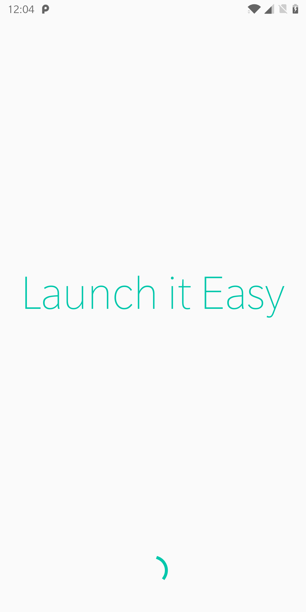
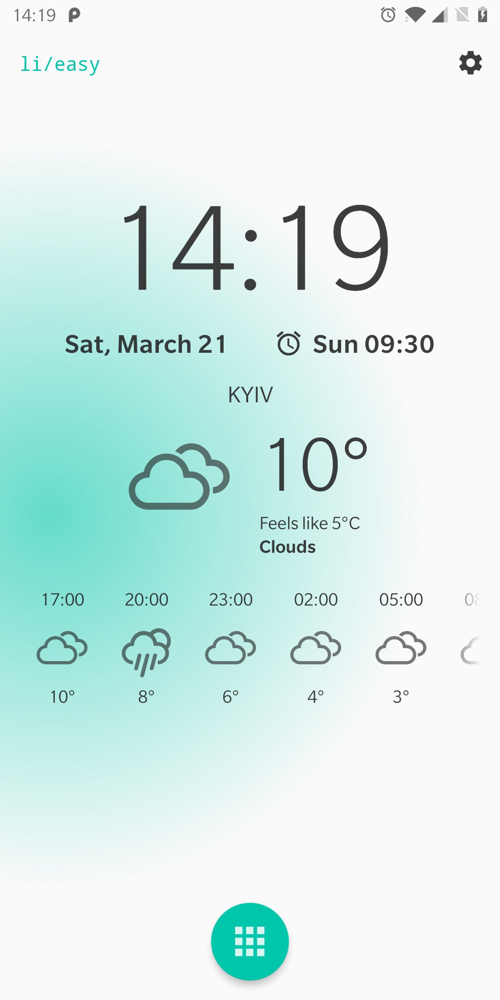
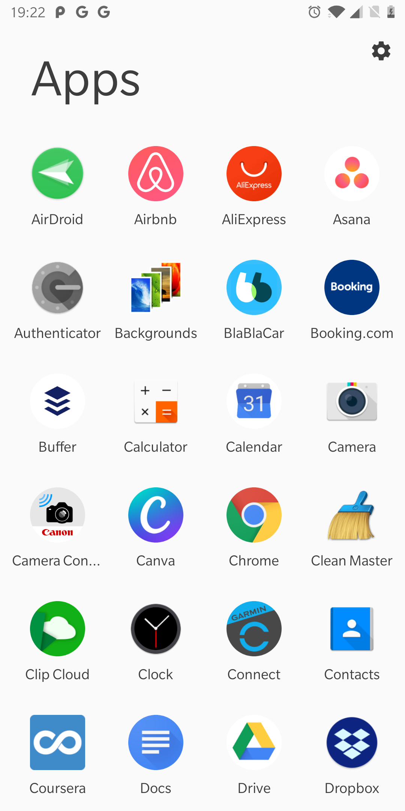
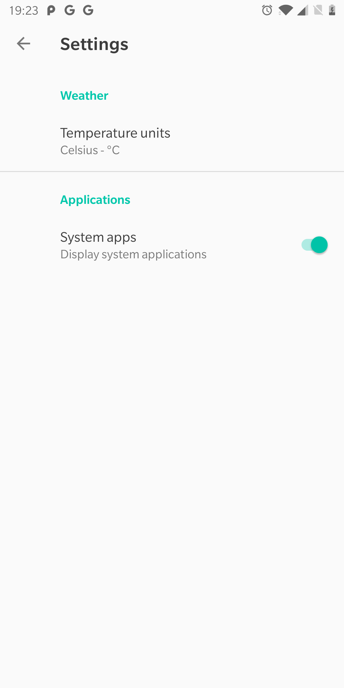

# Launch it Easy

**Yet Another Launcher**

Sample application with a concise home screen, list of installed apps, and OpenWeather API integration.

    

### Features

1. Current time and next alarm
2. OpenWeather API integration:
    - current weather
    - 5-day forecast
3. Installed apps list with filtering option
4. Settings screen

### User Interface

**Splash Screen**

    

**Home Screen**

    

**Apps Screen**

    

**Settings Screen**

    

